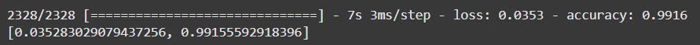
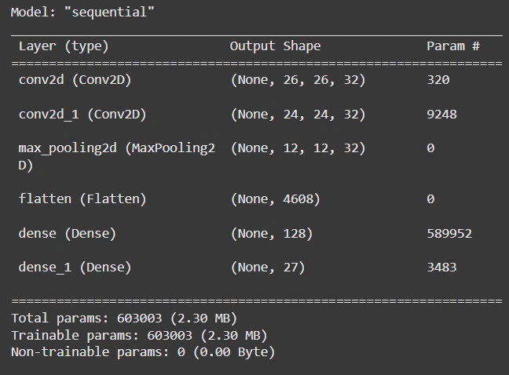
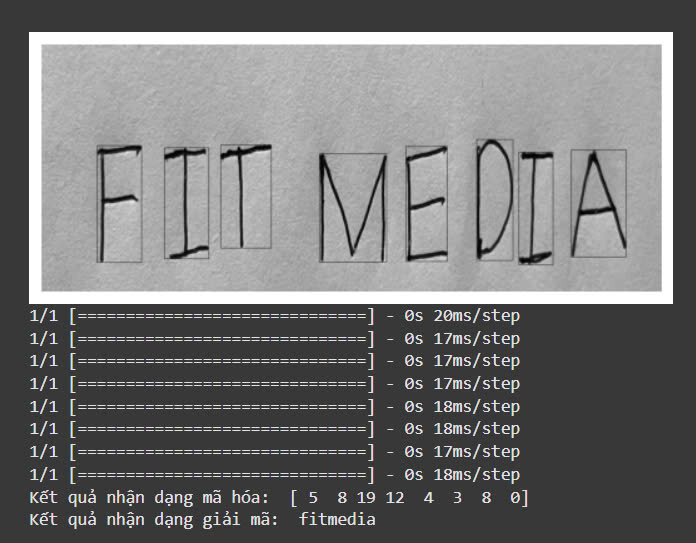

# Letters_Recognition
> The "Handwriting Recognition" project uses deep learning techniques to recognize handwriting from images. This project applies machine learning models, especially convolutional neural networks (**Convolutional Neural Networks - CNN**) to recognize handwritten letters or numbers.

## Target
The goal of this project is to develop a system that can accurately recognize handwriting in input images, which can be applied in areas such as:

+ Recognizing handwriting on invoices and documents.
+ Processing handwriting in optical character recognition (OCR) applications.
+ Developing applications to support people with disabilities or in automated services.

## Features
+ Handwriting recognition: The system can recognize handwritten letters or numbers.

+ Deep Neural Network (CNN) Application: The project uses deep learning models to train and optimize recognition performance.

+ Easy to deploy: The system is built with popular tools and is easy to deploy on many platforms.

## Technology
+ Programming language: Python
+ Libraries: TensorFlow / Keras, OpenCV, Matplotlib, Numpy, Pandas,...
+ Dataset: MNIST
## Results
+ The system can recognize handwritten digits with very high accuracy of about 99.16%

+ Model:

And here is the result:

## Future development
+ Expand the system to recognize more complex characters such as Vietnamese and English handwriting with different fonts.
+ Improve recognition accuracy and speed through techniques such as Transfer Learning or Fine-tuning.

## Contact

If you have any questions or contributions about the project, please contact us via email: quangh922@gmail.com.

## License
This project is released under the **MIT License**.
